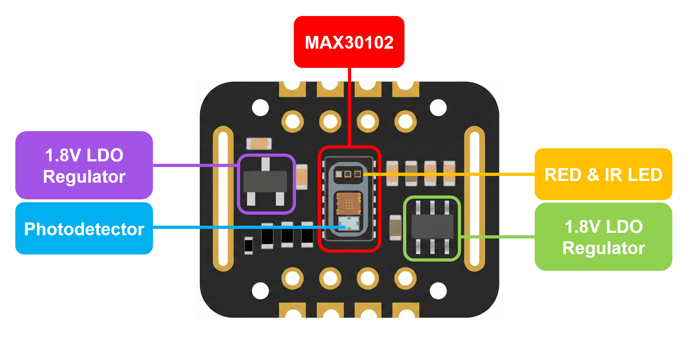
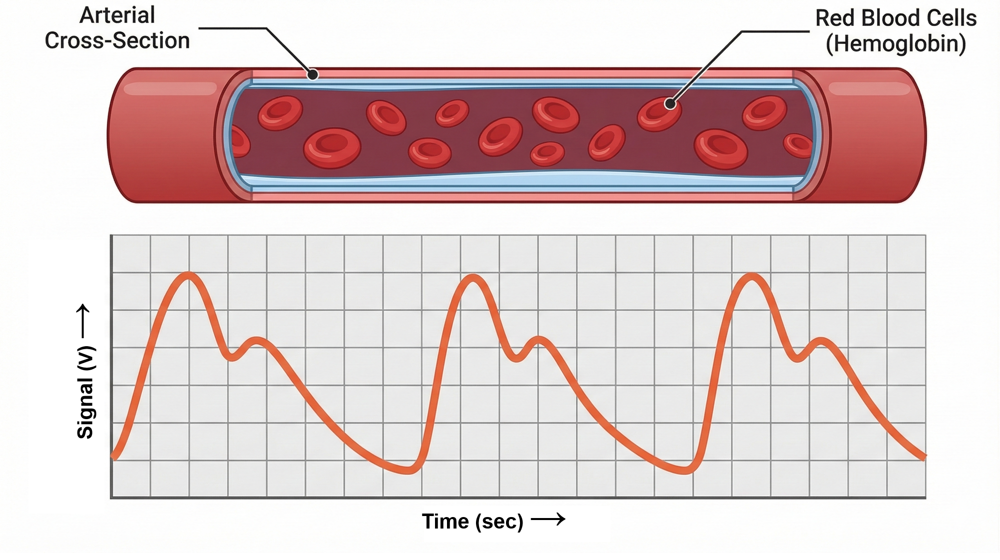
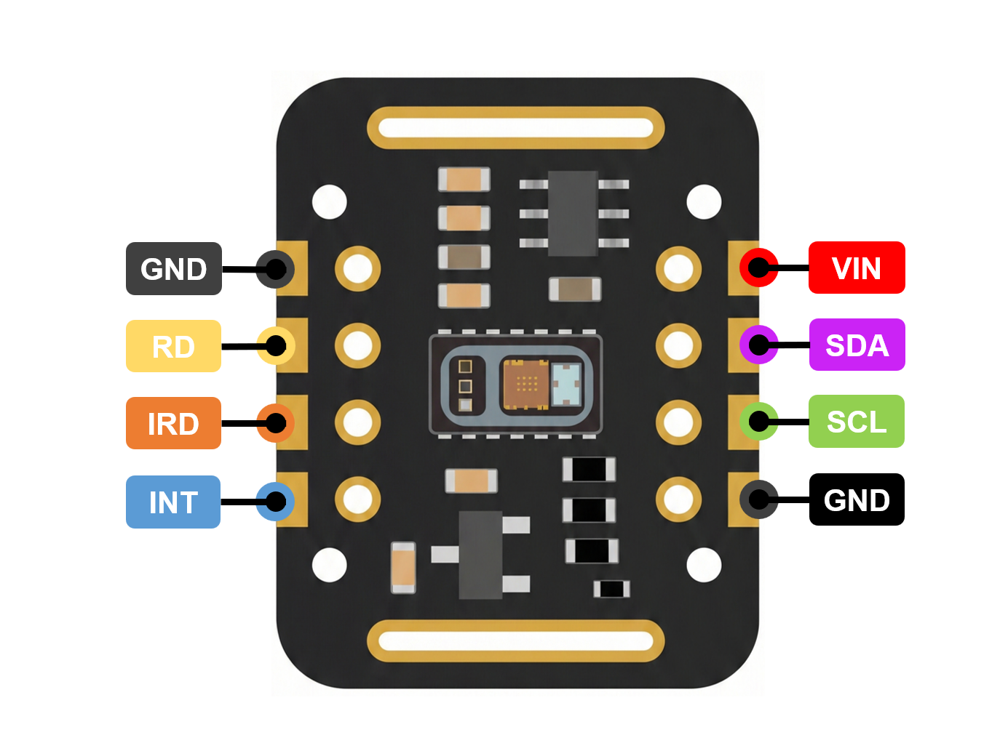
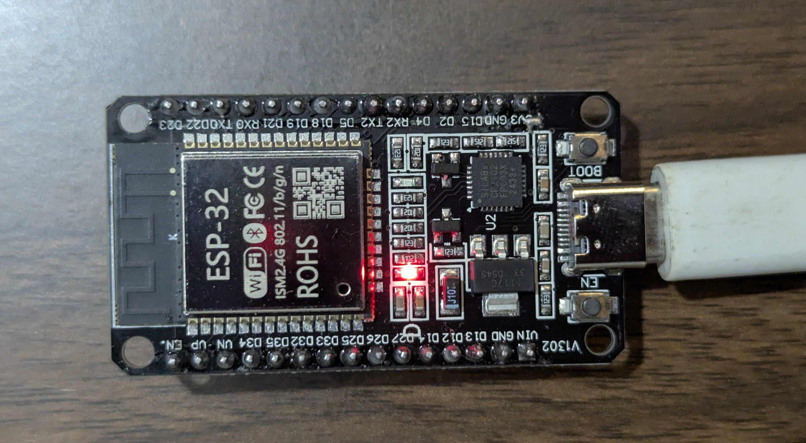
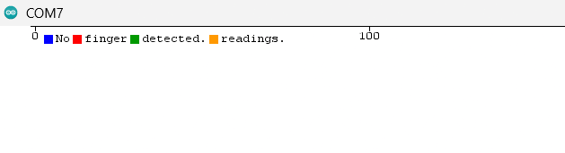
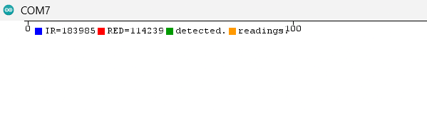
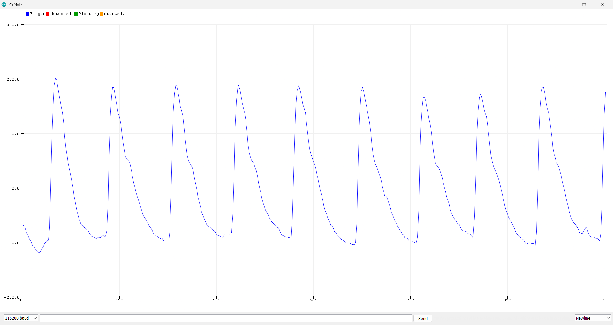
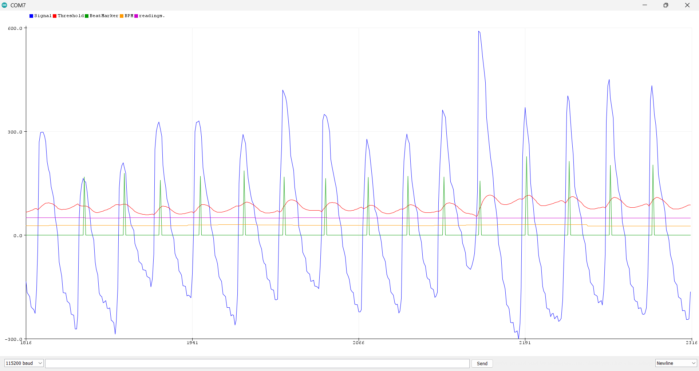
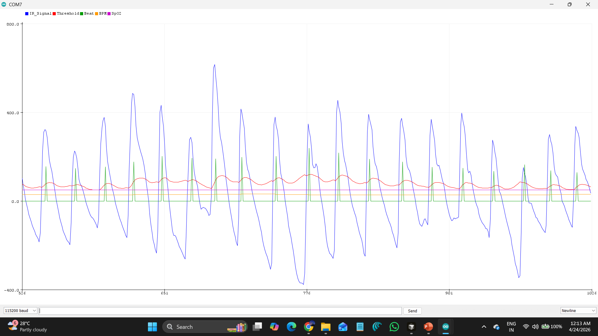

# AikyaNova Labs Embedded Systems - Pulse Oximeter Demo Board

<p align="center">
  
</p>

This directory contains the demonstration codes for testing the MAX30102 Pulse Oximeter and Heart-Rate Sensor using the ESP32 and other development boards.

### ✨ Key Features
* **🩸 Real-time SpO2 & BPM:** Advanced algorithms for reliable heart rate and blood oxygen estimation.
* **📈 Live Waveform Visualization:** See your actual heartbeat via the Arduino IDE Serial Plotter.
* **🧠 Auto-Calibrating LED Power:** Dynamic melanin compensation to accommodate diverse skin tones.
* **⚡ Plug-and-Play I2C:** Native Vin logic (3.3V preferrable) perfectly matched for the ESP32 and other microcontrollers.
* **📺 OLED Integration:** Ready-to-use 0.96" OLED (SSD1306) display routines for standalone operation.

These scripts are designed for hardware validation, educational purposes, and developing advanced biomedical algorithms including photoplethysmography (PPG) waveform visualization, Heart Rate (BPM) calculation and Blood Oxygen Saturation (SpO2) estimation.

## What is the MAX30102 Sensor?

The MAX30102 is an integrated pulse oximetry and heart-rate monitor biosensor module. It includes internal LEDs (Red and Infrared), photodetectors, optical elements and low-noise electronics with ambient light rejection. It operates via an I2C interface, making it easy to connect to microcontrollers like the ESP32.

### [MAX30102 Datasheet:](https://www.analog.com/media/en/technical-documentation/data-sheets/max30102.pdf)

### Hardware Overview

<p align="center">
  
</p>

At the core of this module is the MAX30102 IC (an Analog Devices / Maxim Integrated component). Serving as a robust upgrade to the older MAX30100, this sensor is engineered specifically for precise photoplethysmography (PPG). It is commonly found in commercial smartwatches and fitness trackers due to its compact footprint and high reliability.

The sensor architecture integrates three main components:
* **Dual-Wavelength Emitters:** Two specialized LEDs — one Red (660nm) and one Infrared (880nm) — that project light into the capillary bed of the skin.
* **High-Sensitivity Photodetector:** Measures the amount of light reflected back after being absorbed by pulsating arterial blood.
* **Advanced Signal Processing:** Built-in ambient light rejection and low-noise analog circuitry ensure clean, usable physiological data.

### ⚡ Power and Logic Management
Internally, the bare MAX30102 IC requires two distinct voltage rails: 1.8V for its internal digital logic and 3.3V to drive the LEDs. Fortunately, this breakout module includes onboard voltage regulators, meaning you only need to supply a single power source (typically 3.3V from the ESP32) and the board handles the rest.

The module is configured by default for **3.3V logic levels**, making it natively plug-and-play with microcontrollers like the ESP32 and Arduino. (Note: Some module variants include rear solder jumpers to switch down to 1.8V logic if required by specific low-voltage processors).

### 🌡️ Integrated Temperature Compensation
Accurate SpO2 calculation is highly dependent on environmental stability, as the wavelength of the LEDs can drift with heat. To account for this, the MAX30102 features an integrated on-chip (die) temperature sensor.

While it is not designed to measure human body temperature, it allows our algorithms to dynamically compensate for thermal variations in LED emission. This internal sensor is highly precise, maintaining an accuracy of **±1°C** across a harsh operating range of **-40°C to +85°C**.

### 🔎 Understanding the Artery Signal Graph

<p align="center">
  
</p>

The waveform image above demonstrates the photoplethysmogram (PPG) output.

As your heart pumps blood (systole), the volume of blood in your finger's capillary bed increases. This surge of blood absorbs more of the emitted infrared light, altering the amount of light that reflects back to the photodetector.

* **The Peaks (Systolic Phase):** Every time your heart contracts, a surge of blood is pumped into your capillary bed. Because blood absorbs the light emitted by the sensor's LEDs, this sudden increase in blood volume results in a spike in light absorption, which appears as a distinct peak on the graph.
* **The Valleys (Diastolic Phase):** As blood flows back out of the capillaries between heartbeats, the volume of blood decreases, lowering the light absorption and creating the troughs in the waveform.
* **The Dicrotic Notch:** On a clean signal, you can often see a slight, secondary bump on the downward slope of the wave. This corresponds to a brief change in pressure when the heart's aortic valve closes.
* **Signal Processing:** The raw data from the sensor includes a large "DC offset" (the baseline tissue and venous blood absorption). The `Max3010x_Raw_Plot` sketch strips away this DC baseline to isolate the "AC component" (the pulsating arterial blood), giving you the clean, oscillating wave you see in the plotter.

Our more advanced sketches (`Max3010x_BPM` and `Max3010x_SpO2`) take this exact waveform and apply mathematical algorithms — like dynamic thresholding and exponential moving averages — to automatically count those peaks and calculate your heart rate.

## MAX30102 Pinout

<p align="center">
  
</p>

Ensure the following connections are made for proper I2C communication:

| MAX30102 Pin | ESP32 DevKit Pin | Arduino Pin | Function |
| :--- | :--- | :--- | :--- |
| **VIN** | 3.3V | 3.3V | Power supply |
| **GND** | GND | GND | Ground |
| **SDA** | GPIO 21 | A4 | I2C Data |
| **SCL** | GPIO 22 | A5 | I2C Clock |

The sketches also use a **0.96" SSD1306 OLED Display** connected on the same I2C bus:

| OLED Pin | ESP32 DevKit Pin | Arduino Pin | Function |
| :--- | :--- | :--- | :--- |
| **VCC** | 3.3V | 3.3V | Power supply |
| **GND** | GND | GND | Ground |
| **SDA** | GPIO 21 | A4 | I2C Data (shared) |
| **SCL** | GPIO 22 | A5 | I2C Clock (shared) |

> **I2C Address:** The OLED defaults to `0x3C`. Change `SCREEN_ADDRESS` in the sketch to `0x3D` if your module is not found.

### 🛠 MAX30102 Technical Specifications
- **Communication:** I2C Bus (Default speed up to 400kHz)
- **Sensing Elements:** Red (660 nm) and Infrared (880 nm) LEDs
- **Measurement Metrics:** Heart Rate (BPM) and Blood Oxygen Saturation (SpO2)
- **Operating Voltage:** 3.3V to 5.5V (Typically supplied via VIN)
- **Current Draw:** ~600μA (during measurements), ~0.7μA (during standby mode)
- **Temperature Range:** -40˚C to +85˚C

## 💻 Software Dependencies

To run these sketches, install the following libraries via the Arduino Library Manager (**Sketch > Include Library > Manage Libraries...**):

| Library | Search Term | Purpose |
| :--- | :--- | :--- |
| SparkFun MAX3010x Pulse and Proximity Sensor Library | `MAX30105` | Sensor driver (supports MAX30102) |
| Adafruit SSD1306 | `SSD1306` | OLED display driver |
| Adafruit GFX Library | `Adafruit GFX` | Core graphics (dependency of SSD1306) |

## ⚙️ Included Test Firmware

This folder contains a progressive series of 5 sketches, from basic hardware validation to full biometric calculation.

---

**[`Blink_LED`](Blink_LED/0_Blink_LED.ino)** — Hardware Validation

**Purpose:** Sanity check to confirm the ESP32 board and USB connection are working before connecting any sensors.

**What it does:**
- Configures the built-in LED on GPIO 2 as an output.
- Blinks it ON for 1 second and OFF for 1 second indefinitely.

**How to use:** Upload the sketch. The onboard LED should blink at 0.5 Hz. No libraries or wiring required.

<p align="center">
  
</p>

---

**[`Max3010x_Raw_Values`](Max3010x_Raw_Values/Max3010x_Raw_Values.ino)** — Sensor Communication Test (Sketch 1 of 4)

**Purpose:** Verify that the MAX30102 and OLED display are both wired correctly and communicating over I2C.

**What it does:**
- Initializes both the SSD1306 OLED (I2C address `0x3C`) and the MAX30102 at 400kHz.
- Plays a scrolling welcome message on the OLED, then waits for a finger (IR threshold: 15,000).
- Configures the sensor: `ledBrightness=60`, `sampleAverage=4`, `ledMode=2` (Red+IR), `sampleRate=100`, `pulseWidth=411` (18-bit), `adcRange=4096`.
- Loops at ~50 Hz, printing raw 18-bit IR and RED ADC counts to both the **Serial Monitor** and the **OLED display**.
- If the finger is removed (IR < 15,000), it scrolls the placement prompt and resumes automatically.

**Serial Monitor output (115200 baud):**
```
IR=124530  RED=98214
IR=124602  RED=98270
```

**Serial Plotter output:**
<p align="center">
  
  
</p>

**What to observe:** IR values typically range from 50,000–250,000 with a finger placed. RED values are lower in amplitude. A small beat-to-beat variation in both values confirms the sensor is detecting pulsatile blood flow.

---

**[`Max3010x_Raw_Plot`](Max3010x_Raw_Plot/Max3010x_Raw_Plot.ino)** — Waveform Visualization (Sketch 2 of 4)

**Purpose:** Visualize the raw PPG heartbeat waveform on the Arduino Serial Plotter to verify signal quality before running the BPM or SpO2 algorithms.

**What it does:**
- Configures the sensor: `sampleRate=800`, `sampleAverage=8` → effective output rate of **100 Hz**.
- Applies a fast IIR low-pass filter (bit-shift `>> 4`, equivalent to dividing by 16) to track and remove the slow-moving DC baseline (tissue and venous blood absorption).
- Extracts the AC component (pulsatile arterial signal) by computing `ac = dcIR - ir`, then scales it by `/8` to fit the Serial Plotter axis.
- Outputs the AC value using `sensor.available()` / `sensor.nextSample()` to lock output to exactly one sample per loop — eliminating FIFO backlog bursts that would stretch or compress the displayed waveform.
- If the finger is removed (IR < 15,000), outputs `0` to keep the Serial Plotter flat, scrolls the OLED prompt, flushes stale FIFO samples, and re-seeds the DC baseline on re-placement.

**Serial Plotter output (115200 baud):** Single AC waveform trace, zero-centred, with each heartbeat appearing as an upward peak.

<p align="center">
  
</p>

**What to observe:** A clean, repeating waveform with consistent peak heights. The Serial Plotter's 500-point window covers exactly 5 seconds at 100 Hz, showing 5–6 heartbeat cycles at a resting rate of 60–70 BPM.

---

**[`Max3010x_BPM`](Max3010x_BPM/Max3010x_BPM.ino)** — Heart Rate Extraction (Sketch 3 of 4)

**Purpose:** Measure and display real-time heart rate (BPM) on the OLED display, with a Serial Plotter output for algorithm inspection.

**What it does:**

**Auto-LED Brightness (Melanin Compensation):**
- Starts at `currentPower = 40` (~8mA) and adjusts every 50ms.
- Increases IR LED power if `ir < 60,000` (dark skin / thick finger).
- Aggressively decreases if `ir > 220,000` (very fair skin, risking ADC saturation and dicrotic notch false-triggering).

**Signal Processing (Phases 3–5):**
1. **DC Removal:** IIR filter with `>> 4` shift tracks the slow DC baseline; `ac = dcIR - ir` isolates the AC pulse wave, scaled by `/8`.
2. **Envelope Tracking:** Exponential moving average (`envAlpha = 0.95`) tracks the average peak amplitude. The dynamic threshold is set at `50%` of the envelope — self-adapting to both weak and strong pulses.
3. **Peak Detection:** A local maximum is confirmed when `prev > prev2` AND `prev > x` AND `prev > threshold` AND `env >= 8.0` (signal quality gate). This rejects motion artifacts and barely-touching fingers.
4. **Refractory Period:** 400ms minimum between beats (maximum detectable: ~150 BPM). Specifically tuned to block the dicrotic notch (which arrives ~300–350ms after the systolic peak on fair skin) from being counted as a second beat.
5. **BPM Calculation:** Skips the first beat interval (timestamp seed is arbitrary). From beat 2 onward: `instBpm = 60000 / dt`. Normal smoothing: `bpm = 0.70 * bpm + 0.30 * instBpm`. Sudden >40% jumps (artifact/notch slip-through) receive near-zero weight (`0.98/0.02`).
6. **Stale Timeout:** BPM is cleared if no beat is detected for 3 seconds.

**500ms Warmup:** Skips the finger-absent check for 500ms after placement to let auto-brightness stabilize before enabling the IR < 20,000 removal threshold.

**OLED Display:** Shows `BPM:` label and the live BPM value (large, centre-aligned). A blinking heart icon (13×11px, visible for 150ms per beat) confirms each detected heartbeat. Shows `LOW SIGNAL / Adjust finger` when envelope is below the quality gate.

**Serial Plotter output (115200 baud, 3 traces):**

<p align="center">
  
</p>

---

**[`Max3010x_SpO2`](Max3010x_SpO2/Max3010x_SpO2.ino)** — Full Biometric Extraction (Sketch 4 of 4)

**Purpose:** Simultaneously measure and display Heart Rate (BPM) and Blood Oxygen Saturation (SpO2) on the OLED display.

**What it does:**

**Independent Dual Auto-LED Brightness:**
- IR and Red LED powers are controlled independently every 50ms.
- Melanin absorbs visible Red light significantly more than Infrared, so separate control is essential for accurate SpO2 across all skin tones.
- Both start at `irPower = redPower = 40` and follow the same 3-band control logic as the BPM sketch.

**SpO2 Algorithm (Ratio-of-Ratios method):**
Executed on every confirmed heartbeat (from beat 2 onward):
1. Peak-to-peak AC amplitude is tracked per beat cycle for both IR (`irMax - irMin`) and Red (`redMax - redMin`).
2. Normalise each channel by its DC baseline: `nir = acIRAmp / dcIR`, `nred = acREDAmp / dcRED`.
3. Compute the R-ratio: `R = nred / nir`.
4. Apply the empirical linear model: **`SpO2 = 110 - 25 × R`**
5. Clamp to the physiologically valid range: `[70%, 100%]`.
6. Smooth with an EMA: `spo2 = 0.80 * spo2 + 0.20 * spo2Inst` (20% new-beat weight — slower than BPM to improve stability).
7. Peak-to-peak trackers are reset each beat cycle so only the current beat's amplitude is used.

**Stale Timeouts:** BPM cleared after 3s without a beat. SpO2 cleared after 10s without a valid beat.

**`resetState()` helper:** Called on both finger removal and re-placement. Resets all variables — DC baselines, BPM, SpO2, envelope, peak trackers, beat count, LED powers — to prevent stale values from seeding the next measurement.

**OLED Display:** Side-by-side layout: `BPM` (left) and `SpO2` (right) with a percentage symbol, both at textSize 3. A blinking heart at the bottom-centre confirms each beat. Shows `LOW SIGNAL` and `--` appropriately when values are not yet valid.

**Serial Plotter output (115200 baud, 5 traces):**

<p align="center">
  
</p>

---

## ℹ️ Troubleshooting Guide

**"MAX30102 not found" / "SSD1306 allocation failed" Error**
- Check your wiring. Ensure SDA is on GPIO 21 and SCL is on GPIO 22 (ESP32).
- Verify the sensor and OLED are receiving stable 3.3V power.
- If only the OLED fails, try changing `SCREEN_ADDRESS` from `0x3C` to `0x3D`.

**Noisy or Erratic Readings**
- **Motion Sensitivity:** The MAX30102 is highly sensitive to motion and ambient light.
- **Finger Placement:** Ensure your finger is placed gently but firmly on the sensor (pressing too hard restricts blood flow).
- Keep your hand completely still while measuring.

**BPM Reads ~Double the Actual Rate (e.g., 140 instead of 70)**
- The dicrotic notch is being detected as a second beat. This is handled in firmware with the 400ms refractory period. If it persists, try reducing LED power by lowering `currentPower` / `irPower` starting values, or check for a saturated IR signal (`ir > 220,000`).

**SpO2 Value Stuck or Oscillating Wildly**
- SpO2 requires both IR and Red channels to have sufficient AC amplitude (at least 1 ADC count peak-to-peak after filtering). Ensure the Red LED power is sufficient — the `redPower` auto-brightness loop in `Max3010x_SpO2.ino` handles this, but it may need a few seconds to settle on dark skin.
- SpO2 uses a 10-second stale timeout; allow at least 3–4 stable beats before a value is displayed.

## ⚠️ Safety and Handling

> **NOT FOR MEDICAL DIAGNOSIS**
> These sketches and the MAX30102 module are developed for hardware validation and educational purposes within the AikyaNova Labs ecosystem. They are **not** FDA-approved medical devices and should not be used to diagnose or treat any medical conditions.

## 📖 Notes

- These tests are designed for hardware validation and algorithm development within the AikyaNova Labs ecosystem.
- The SparkFun MAX30105 library is fully compatible with the MAX30102 sensor — search for `MAX30105` in the Arduino Library Manager.

## Brand and License

All materials are under the AikyaNova™ brand and are licensed for non-commercial use only. See `LICENSE` for details.
